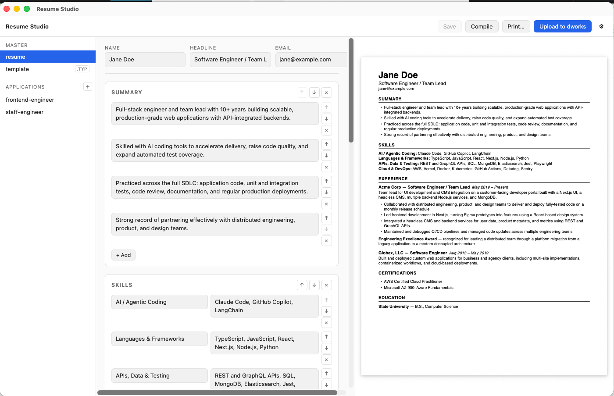

# Resume Studio

A native macOS desktop app for authoring [Typst](https://typst.app/)-based résumés — edit structured content or raw Typst, preview the compiled PDF side-by-side, spin off tailored variants per application, and publish the plain-text version to a personal web backend.

Built with [Tauri 2](https://tauri.app/) (Rust) + React 19 + TypeScript + Vite.



## Features

- **Structured editor** — edit résumé content as typed fields (summary, skills, experience, certifications, education) backed by a simple JSON schema, or drop to raw Typst for full control.
- **Live PDF preview** — compile with the `typst` CLI and preview the result in-app; open in Preview.app with one click.
- **Master + variants** — keep one master résumé and generate per-application variants (seeded from the master or the current file) under an `applications/` folder.
- **Publish** — render the résumé to plain text and `POST` it to a configurable HTTP endpoint (e.g. your own site's API) with a Bearer token stored securely in the macOS Keychain.
- **In-app dialogs** — confirmation, new-variant, upload, and settings flows (no reliance on native `window.confirm`, which the Tauri webview suppresses).

## How it works

Résumés are plain files on disk, driven by a shared Typst template:

```
<resume_dir>/
  template.typ              # shared layout — all résumés import this
  resume.typ / resume.json  # the "master" résumé (driver + data)
  applications/
    <variant>.typ           # #import "../template.typ": resume
    <variant>.json          # the variant's structured data
  build/
    <name>.pdf              # compiled output
```

Each `.typ` driver is a two-liner that imports `template.typ` and passes in its `.json` data:

```typst
#import "../template.typ": resume
#resume(json("my-variant.json"))
```

Because every résumé imports the one shared `template.typ`, layout changes apply everywhere. The structured editor reads/writes the `.json`; `template.typ` turns it into a typeset PDF.

## Configuration

On first run the app reads `~/Library/Application Support/resume-studio/config.json`:

| Field               | Description                                               |
| ------------------- | -------------------------------------------------------- |
| `resume_dir`        | Folder holding your résumé sources (`template.typ`, etc.) |
| `build_dir`         | Where compiled PDFs are written                          |
| `dworks_upload_url` | HTTP endpoint the "Upload" action POSTs to               |
| `typst_path`        | Path to the `typst` binary                               |

Config is cached at startup, so edits require an app restart. Settings can also be changed in-app via the Settings dialog.

The upload **token** is *not* stored in config — it lives in the macOS Keychain (service `resume-studio`) and is set/cleared through the Settings dialog.

### Upload wire format

The Upload action sends `POST { name, content, activate }` as JSON with an
`Authorization: Bearer <token>` header. `content` is the résumé rendered to
plain text. The receiving endpoint is entirely up to you — point
`dworks_upload_url` at any service that accepts that payload.

## Development

**Prerequisites**

- [Rust](https://www.rust-lang.org/tools/install) (stable) + Xcode command-line tools
- [Node.js](https://nodejs.org/) 18+
- [Typst CLI](https://github.com/typst/typst) (`brew install typst`)

**Run**

```bash
npm install
npm run tauri dev      # Vite dev server + hot-reloading Tauri window
```

**Build**

```bash
npm run tauri build            # release .app under src-tauri/target/release/bundle/macos/
# or, to also ad-hoc code-sign so Gatekeeper accepts it:
./scripts/build.sh
```

The build is unsigned (ad-hoc at best), so on first launch macOS Gatekeeper
may block it — right-click the app → **Open** to run it anyway. Drag the
`.app` into `/Applications` to install.

## Project layout

```
src/                     # React frontend
  App.tsx                # top-level state + orchestration
  components/            # editor, file tree, dialogs, preview, toasts
  lib/tauri.ts           # typed wrappers around Tauri commands + resume schema
src-tauri/src/lib.rs     # Rust backend: file I/O, typst compile, keychain, upload
```

## License

Personal project — no license granted. All rights reserved.
